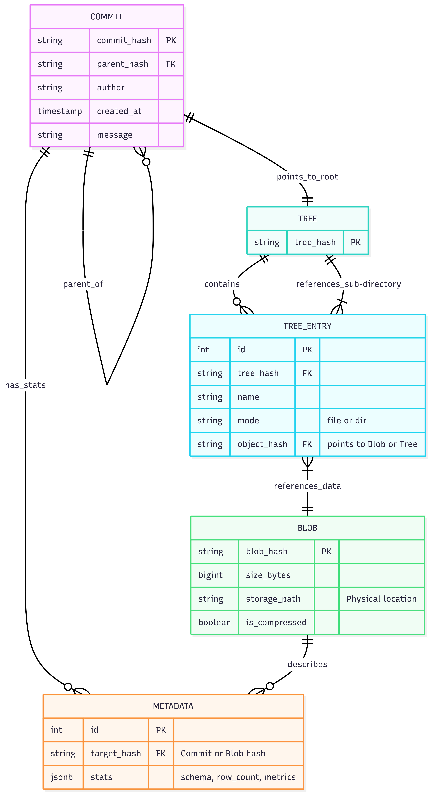

# DataHub: Merkle DAG-Backed Content-Addressable Storage for ML Data Lineage

## 1. Executive Summary
DataHub is a distributed version control system (VCS) engineered specifically for high-volume binary datasets and machine learning models. Unlike traditional source control systems (e.g., Git), which degrade in performance with large binary files, DataHub utilizes a **Content-Addressable Storage (CAS)** architecture backed by a relational database. The system provides atomic versioning, automatic data deduplication, and granular lineage tracking for AI/ML workflows via a Python-based Command Line Interface (CLI).

## 2. Problem Statement
In modern data science and machine learning pipelines, the "Reproducibility Crisis" is a significant bottleneck. While code is versioned via Git, the associated datasets (gigabytes in size) and model weights are often managed manually. This leads to:
- **Redundancy**: Massive storage waste due to saving multiple copies of slightly modified datasets.
- **Loss of Lineage**: Inability to mathematically prove which dataset version produced a specific model.
- **Concurrency Issues**: Race conditions when multiple researchers attempt to modify data registries simultaneously.

## 3. System Architecture & Database Logic
The core innovation of DataHub lies in its implementation of a **Merkle Directed Acyclic Graph (DAG)** within a PostgreSQL environment to ensure data integrity and storage efficiency.

### 3.1. The Content-Addressable Storage (CAS) Model
DataHub separates the logical state of a project from its physical storage.
- **Deduplication**: When a file is committed, the system computes its SHA-256 hash. If the hash already exists in the Blobs registry, the physical upload is skipped, and a new pointer is created. This results in $O(1)$ storage cost for duplicate data.
- **Immutable Blob Storage**: Binary objects are stored in a flat file system (or object storage), indexed strictly by their hash. This guarantees that data, once written, can never be silently corrupted.

### 3.2. The Database Schema (DBMS Core)
The relational database acts as the "Index" and "State Manager" for the system. It implements a **Merkle Directed Acyclic Graph (DAG)** to track versioning and data integrity.



#### Core Entities & Attributes

| Entity | Primary Attributes | Description |
| :--- | :--- | :--- |
| **COMMIT** | `commit_hash` (PK), `parent_hash` (FK), `author` (optional metadata), `created_at`, `message` | Represents a specific version/snapshot of the project. Implements a recursive relationship for history. |
| **TREE** | `tree_hash` (PK) | Represents a directory structure. Serves as a root for a specific commit. |
| **TREE_ENTRY** | `id` (PK), `tree_hash` (FK), `name`, `mode`, `object_hash` (FK) | Maps filenames to their physical storage (Blobs) or sub-directories (Trees). |
| **BLOB** | `blob_hash` (PK), `size_bytes`, `storage_path`, `is_compressed` | Stores the actual file content, indexed by its SHA-256 hash for deduplication. |
| **METADATA** | `id` (PK), `target_hash` (FK), `stats` (JSONB) | Stores statistical properties (schemas, row counts, metrics) associated with a commit or file. |

#### Relational Architecture
- **Inverted Indexing**: Files are first hashed into `BLOBs`. `TREE_ENTRY` records then map project-relative paths to these immutable hashes.
- **Recursive DAG**: The `COMMIT` table uses a self-referencing `parent_hash` to reconstruct the timeline of changes.
- **Atomic Snapshots**: A single `commit_hash` points to a root `TREE`, which recursively defines the entire state of the repository at that moment.

- **Commits Table**: Implements a recursive relationship (`ParentHash` FK) to build the version history tree.
- **TreeObjects Table**: Stores directory structures as JSONB objects, mapping file paths to their respective Blob Hashes.
- **Metadata Table**: A queryable index that extracts and stores statistical properties of the data (e.g., row counts, schema definitions, model accuracy metrics) upon commit.

## 4. Standardized Technical Stack & Interfaces

To perfectly decouple concurrent development across six developers while guaranteeing everything compiles together flawlessly, we mandate a homogeneous **100% Python Architecture globally managed inside a shared Docker container footprint.**
- **Datastore:** PostgreSQL Native CTEs interacting logically via strict SQLAlchemy (no raw SQL allowed).
- **Storage/Parser:** Python chunks bound by OS-level generators iterating streams (drastically reducing RAM overhead on ML Blobs).
- **Communication:** Internal modules natively import cleanly. The only boundary layer rests between the user's Client CLI and the API Gateway (FastAPI `POST`).

## 5. Implementation Orchestration (How It Fits Together)

Every module owner assumes a distinct "Black Box" approach, consuming and exposing predictable Python contracts defined in the README files contained sequentially inside your explicit directory (e.g. `storage/README.md`):

1. **Upload Triggered (CLI -> API):** Medishetty's CLI (`Module 3`) hashes files, skipping overlaps locally, then chunks new streams executing natively into Shetty's Router (`Module 4`).
2. **Ingestion (API -> Storage):** The Gateway catches streams via FastAPI `UploadFile`, streaming chunks straight to Khemka's Deduplication Engine (`Module 2`), securing the Blob.
3. **Analytics (Storage -> Metadata):** Upon hitting the immutable disk layer, Shetty triggers Kumar's Parsing script (`Module 5`), extracting structural integrity JSONs describing dataset anomalies safely.
4. **Commit & Lineage (API -> Architecture):** With hashes generated, the Payload executes natively into Kiran's DAG Schema (`Module 1`), locking the snapshot logically against topological Git-like parents generating Recursive pointers.
5. **Search/Report (CLI -> Query -> Architecture):** Users query their analytics (`datahub log --metric "accuracy > 0.9"`). Reddy's Query DSL Parser (`Module 6`) consumes the string protecting it via AST maps before pulling Native CTE matches efficiently mapping backwards.

## 6. Global Execution & Testing

Everything operates inside Docker natively. Natively installing local dependencies outside of `docker-compose.yml` guarantees execution divergence and is forbidden. 

### Bootstrapping The Repository
1. Install Docker Desktop.
2. Spin up the underlying Database and unified isolated test shell:
   ```bash
   docker-compose up -d --build
   ```
3. Your local folder dynamically mounts inside the container (`dev-env`), enabling instant development reflection natively avoiding OS mismatching scripts. 

### Running Modular Assertions
Inside your component folders (e.g., `api/tests`), you define decoupled pytest methods enforcing your individual components constraints smoothly. Execute them blindly utilizing Docker:
```bash
docker-compose run --rm dev-env pytest
```
When all individual tests hit an Exit Code 0, the final seamless pipeline guarantees successful deployment perfectly aligned.

## 7. Using DataHub in Your ML Projects (CLI Guide)

DataHub is designed to be a drop-in Version Control System for any Machine Learning repository. To natively track your data changes seamlessly, follow these CLI commands.

For a fully manual, live terminal walkthrough (including direct SQL checks), use the dedicated guide in `live_demo_workspace/LIVE_DEMO.md`.

*Disclaimer: Since DataHub enforces strict dependency isolation, all commands must be executed through the Docker `dev-env` shell container.*

**1. Initialize a Repository**
Navigate to your project folder where your data lives and initialize the internal Merkle trackers:
```bash
# Example running from your dataset folder
docker-compose run --rm -w /app/your_project dev-env python -m cli.main init
```

**2. Commit Your Datasets & Code**
Modifying code, datasets, or metrics? The engine automatically calculates the minimal exact physical file changes hashing natively to Content-Addressable Storage (CAS), preventing duplication!
```bash
docker-compose run --rm -w /app/your_project dev-env python -m cli.main push http://localhost:8000 -m "Added latest ResNet weights"
```

**3. Analyze Merkle Graph History**
At any point, track the history of datasets and lineage:
```bash
docker-compose run --rm -w /app/your_project dev-env python -m cli.main log http://localhost:8000
```

**4. Query the Automated Metadata Layer**
DataHub natively parses metrics (like CSV schemas or JSON evaluation metrics). Use our advanced Domain Specific Language (DSL) to search previous commits for specific AI properties!
```bash
docker-compose run --rm -w /app/your_project dev-env python -m cli.main query http://localhost:8000 "row_count > 10000"
```

## 8. API Gateway Endpoints Spec

The system relies on a seamless FastAPI Gateway exposing Python contracts to the User CLI.

| Endpoint | Method | Payload | Function |
| :--- | :--- | :--- | :--- |
| `/blobs` | `POST` | `multipart/form-data` | Streams binary files into internal Content-Addressable Storage via chunking. |
| `/check_hash/{hash}` | `GET` | *(Path Variable)* | Verifies if a SHA-256 chunk already exists globally (enabling deduplication). |
| `/commit` | `POST` | `{"commit_hash"..., "entries": [...]}` | Writes a logical version snapshot and extracts dataset metrics on the server backend. |
| `/log` | `GET` | *(None)* | Retrieves the entire Git-like linear Postgres representation of the `Commit` and `Tree` DAG. |
| `/query` | `POST` | `{"query": "operator > value"}` | Invokes the AST Parser against DataHub's extracted metadata tables to fetch advanced insights. |
